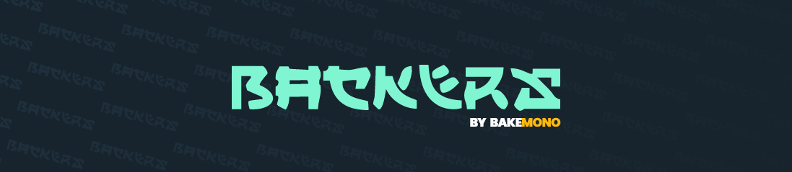

# BACKERS
Backers is the next social-media crowdfunding platform that allows creative content creators to build their own subscription based content service. The platform is for content creators, entrepreneurs, artists, writers, musicians and other categories of creators who post regulary online.

## Project Navigation

This project is structured based on the module architecture. Here are the navigation of diiferent files and folders structures:

- [Assets](/assets) - Storing fonts, images, htmls and other assets files for application.
- [Config](/lib/config) - All application configs files are located here.
- [Constants](/lib/constants) - Constants throughout the application is placed here.
- [Core](/lib/core) - Contains the core funcitionality of the app.
- [GbModels](/lib/gb_models) - Place for global models.
- [Modules](/lib/modules)  - Has all modules for the app containing blocs, models, repository and screens of each.
- [Utils](/lib/utils) - Has all the utitlies: helpers, mixins, and services.
- [Widget](/lib/widgets) - Contains all the custom widgets for ui.

## Libraries used

All the external libraries used in the project are listed here. Any new future libraries will be also listed.

- [bloc: ^8.0.1](https://pub.dev/packages/bloc)
- [flutter_bloc: ^8.0.0](https://pub.dev/packages/flutter_bloc)
- [hydrated_bloc: ^8.0.0](https://pub.dev/packages/hydrated_bloc)
- [replay_bloc: ^0.2.1](https://pub.dev/packages/replay_bloc)
- [rx_bloc: ^3.2.0](https://pub.dev/packages/rx_bloc)
- [flutter_rx_bloc: ^4.0.0](https://pub.dev/packages/flutter_rx_bloc)
- [equatable: ^2.0.3](https://pub.dev/packages/equatable)

